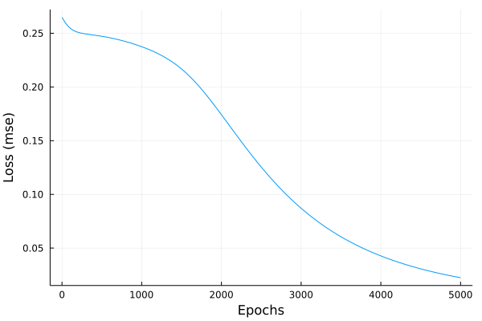

# Xor Gate problem solved with Julia and Flux
This is a simple example showing how to solve a xor gate problem using  [flux package](https://fluxml.ai/Flux.jl/stable/) and [julia language](https://julialang.org/).
The example uses a model with 2 input, 2 neurons in hidden layer and 1 neuron on output. The model is treined with 5K epochs and learning rate 0.01. The results below are precise.

* Loss plot



* Output and results
```
0.0009724368f0

1×4 Matrix{Float32}:
 0.0339698  0.968825  0.96901  0.0283466
```